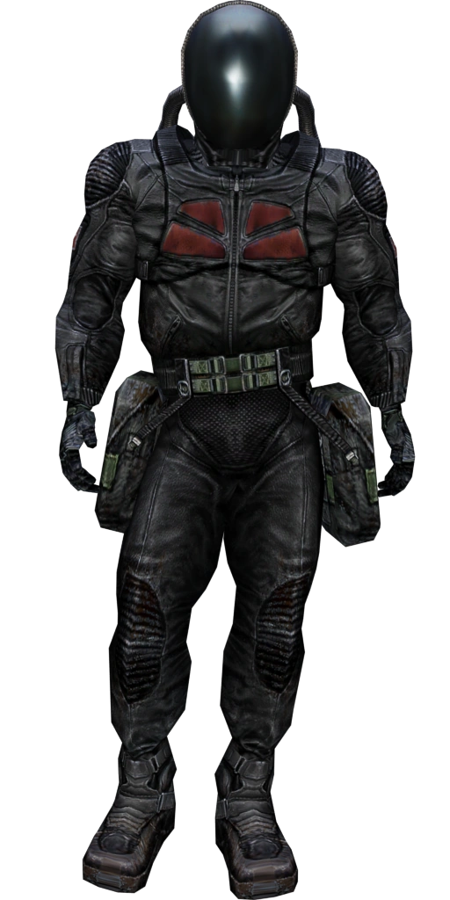
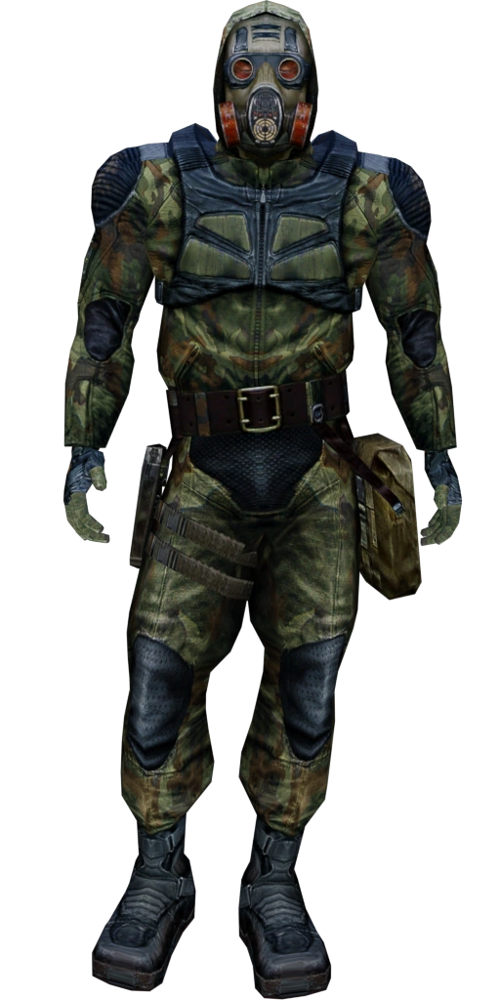
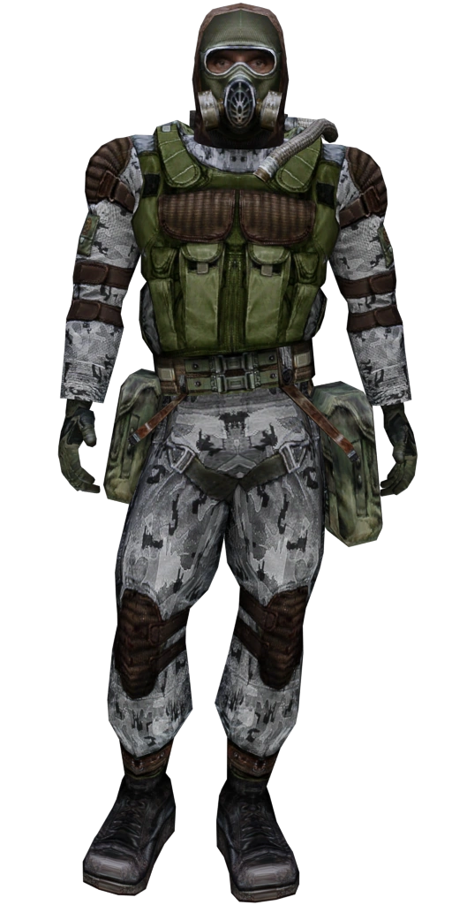
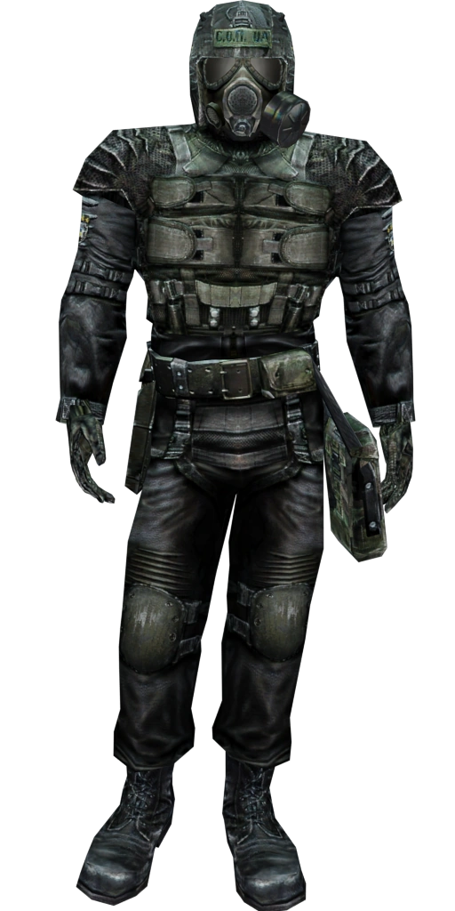

# SOC: Alternative Ballistics - NPC Armor Reference

This reference guide provides a visual overview of in-game NPCs and their corresponding armor configurations within the Alternative Ballistics Addon.

The information is compiled from the damages.ltx file, reflecting the changes introduced by the addon. Images showcasing the NPCs and their armor sets are courtesy of the S.T.A.L.K.E.R. Wiki: Zone Chronicles.

## Bandits

### \[stalker_bandit_1\]:leather_jacket_damage,basic_damage

hit_fraction = 0.6;0.5

### \[stalker_bandit_2\]:bandit_trenchcoat_damage,basic_damage

hit_fraction = 0.5;0.2

## Duty

### \[stalker_dolg_1\]:duty_light_damage,full_gas_damage

hit_fraction = 0.5;0.3

### \[stalker_dolg_2\]:duty_light_damage,basic_damage

hit_fraction = 0.5;0.3

### \[stalker_dolg_3\]:duty_light_damage,full_glass_damage

hit_fraction = 0.5;0.3

### \[stalker_dolg_4\]:exo_damage,exo_gas_damage

hit_fraction = 0.3;0.1

## Freedom

### \[stalker_freedom_1\]:freedom_light_damage,full_gas_damage

hit_fraction = 0.5;0.3

### \[stalker_freedom_2\]:freedom_light_damage,basic_damage

hit_fraction = 0.5;0.3

### \[stalker_freedom_3\]:freedom_light_damage,full_glass_damage

hit_fraction = 0.5;0.3

### \[stalker_freedom_4\]:exo_damage,exo_gas_damage

hit_fraction = 0.3;0.1

## Mercenaries

### \[stalker_merc_1\]:merc_suit_damage,full_gas_heavy_damage

hit_fraction = 0.4;0.3

### \[stalker_merc_2\]:merc_suit_damage,basic_damage

hit_fraction = 0.4;0.3

### \[stalker_merc_3\]:duty_light_damage,full_glass_damage

hit_fraction = 0.5;0.3

### \[stalker_merc_4\]:exo_damage,exo_gas_damage

hit_fraction = 0.3;0.1

## Monolith

### \[stalker_monolith_1\]:mono_light_damage,full_gas_damage

hit_fraction = 0.5;0.3

### \[stalker_monolith_2\]:mono_light_damage,basic_damage

hit_fraction = 0.5;0.3

### \[stalker_monolith_3\]:mono_light_damage,full_glass_damage

hit_fraction = 0.5;0.3

### \[stalker_monolith_4\]:exo_damage,exo_gas_damage

hit_fraction = 0.3;0.1

## Loners

### \[stalker_neutral_1\]:leather_jacket_damage,basic_damage

hit_fraction = 0.6;0.5

### \[stalker_neutral_2\]:stalker_suit_damage,basic_damage

hit_fraction = 0.5;0.3

### \[stalker_neutral_3\]:stalker_suit_damage,full_gas_damage

hit_fraction = 0.5;0.3

### \[stalker_neutral_4\]:duty_light_damage,full_glass_damage

hit_fraction = 0.5;0.3

### \[stalker_neutral_5\]:exo_damage,exo_gas_damage

hit_fraction = 0.3;0.1

## Military

### \[stalker_soldier_1\]:military_light_damage,basic_damage

hit_fraction = 0.5;0.3

### \[stalker_soldier_2\]:military_berill_damage,mili_helmet_damage

hit_fraction = 0.4;0.2

### \[stalker_soldier_3\]:military_berill_damage,full_gas_heavy_damage

hit_fraction = 0.4;0.2

### \[stalker_soldier_4\]:military_specops_damage,full_gas_heavy_damage

hit_fraction = 0.4;0.1

<!--  -->

<!--  -->

## Ecologists

### \[stalker_scientist_1\]:mono_light_damage,full_glass_damage

hit_fraction = 0.4

### \[stalker_scientist_2\]:mono_light_damage,full_glass_damage

hit_fraction = 0.4

## Zombified Stalkers

### \[stalker_zombied_1\]:leather_jacket_damage,basic_damage

hit_fraction = 0.3;0.2

### \[stalker_zombied_2\]:stalker_suit_damage,basic_damage

hit_fraction = 0.3;0.2

### \[stalker_zombied_3\]:exo_damage,exo_gas_damage

hit_fraction = 0.3;0.2

